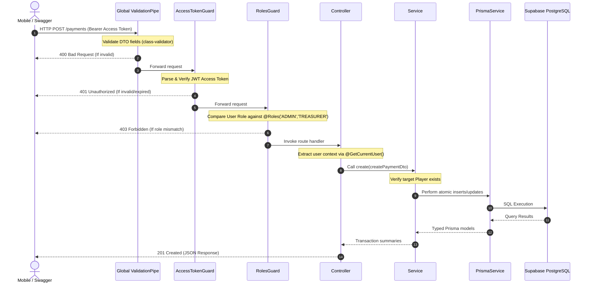

# System Flow & Request Lifecycle

## Completed API Request Lifecycle

---

## Data Relations

*   **Season & Matches:** A single `Season` contains multiple scheduled or completed `Matches`.
*   **Matches & Roster Mappings:** A completed match stores implicit player roster lists (`teamAPlayers`, `teamBPlayers`) and links a specific MVP player profile ID (`mvpId`). Standings points are calculated dynamically (**Win = 3pts, Draw = 2pts, Loss = 1pt**).
*   **Players & Finance logs:** A player accumulates multiple billing records inside the payment tables. The listing checks user role permissions, dynamically filtering records so standard users only fetch their connected profile logs.